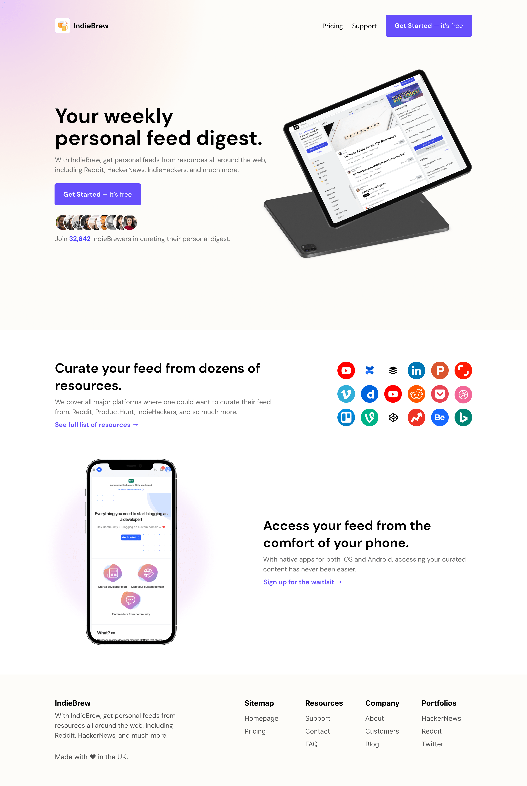

# Codwell - IndieBrew Landing Page Page

This is a solution to the [IndieBrew Landing Page on Codewell.cc](https://www.codewell.cc/challenges/indiebrew-landing-page--608aca51650dff001599e8f9).

## Overview

### The challenge

Users should be able to:

- View the optimal layout for the site depending on their device's screen size

### Screenshot

### Links

- Solution URL: [Solution URL](https://www.codewell.cc/challenges/indiebrew-landing-page--608aca51650dff001599e8f9/solution/61e0a35c6da8ba3fac6b032f)
- Live Site URL: [Live Site URL](https://codewell-indiebrew-landing-page-challenge.netlify.app/)

### Built with
- SASS
- CSS Grid
- Flexbox
- Mobile-first workflow

## Author
- Frontend Mentor - [@jtrivel](https://www.frontendmentor.io/profile/jtrivel)
- Twitter - [@jtrivel](https://www.twitter.com/jtrivel)
